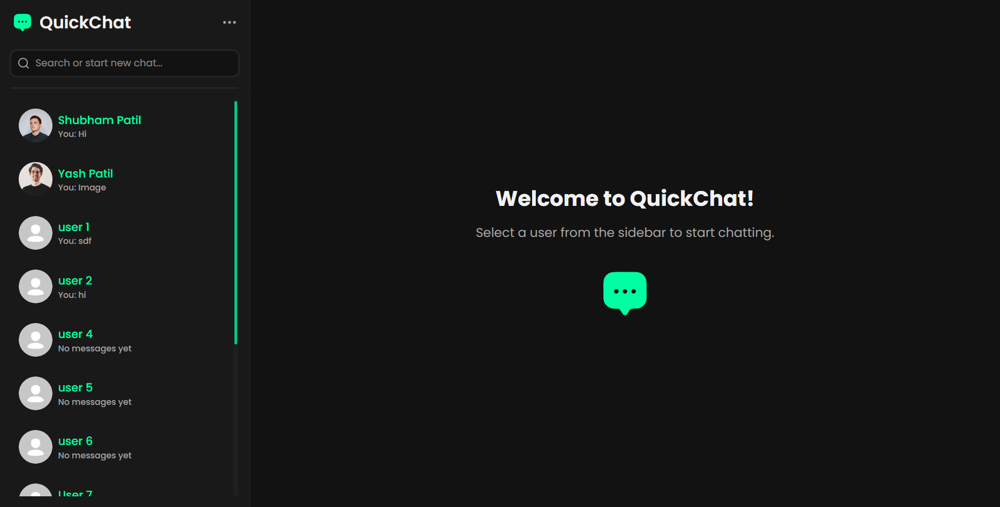

# QuickChat

A full-stack, real-time chat application built with the MERN stack (MongoDB, Express, React, Node.js) and Socket.IO.

> **Note**: This Project was built for learning purposes. It is not intended for production use.

## Live Demo

Check out the live version of QuickChat here: [https://quick-chat-site.vercel.app](https://quick-chat-site.vercel.app)

### Screenshot



## Features

- **Real-time Messaging**: Instantly send and receive messages with Socket.IO.
- **User Authentication**: Secure user signup and login using JSON Web Tokens (JWT).
- **Image Sharing**: Upload and share images with Cloudinary integration.
- **Responsive UI**: A clean and modern user interface built with React and Tailwind CSS.

---

## Tech Stack

### Backend

- **Node.js** & **Express.js**
- **MongoDB** with **Mongoose**
- **Socket.IO**
- **JWT** for Authentication
- **Cloudinary** for Image Storage

### Frontend

- **React** (with Vite)
- **Tailwind CSS**
- **Socket.IO Client**
- **React Router** for navigation
- **Axios** for API requests

---

## Getting Started

Follow these steps to get the project running on your local machine.

### Prerequisites

- **Node.js** (v14 or higher)
- **MongoDB** (a local instance or a connection URI from Atlas)
- A free **Cloudinary** account.

### Installation & Setup

1.  **Clone the repository:**

    ```sh
    git clone https://github.com/Shubham-567/Quick-Chat.git

    cd QuickChat
    ```

2.  **Set up the Backend:**

    - Navigate to the backend folder: `cd Backend`
    - Install dependencies: `npm install`
    - Create a `.env` file and add the following variables:

      ```env
      MONGODB_URI=your_mongodb_connection_string

      JWT_SECRET=your_super_secret_key

      CLOUDINARY_CLOUD_NAME=your_cloudinary_cloud_name

      CLOUDINARY_API_KEY=your_cloudinary_api_key

      CLOUDINARY_API_SECRET=your_cloudinary_api_secret
      ```

3.  **Set up the Frontend:**
    - Navigate to the frontend folder: `cd ../Frontend`
    - Install dependencies: `npm install`
    - Create a `.env` file and add your backend URL:
      ```env
      VITE_BACKEND_URL=http://localhost:3000
      ```

### Running the Application

You need to run the backend and frontend servers in **two separate terminals**.

1.  **Start the Backend Server:**

    - In the `/Backend` directory, run:

    ```sh
    npm run server
    ```

2.  **Start the Frontend Development Server:**
    - In the `/Frontend` directory, run:
    ```sh
    npm run dev
    ```

Your application should now be running! Open your browser and go to `http://localhost:5173` (or the address provided by Vite).

---

## License

This project is licensed under the MIT License.
